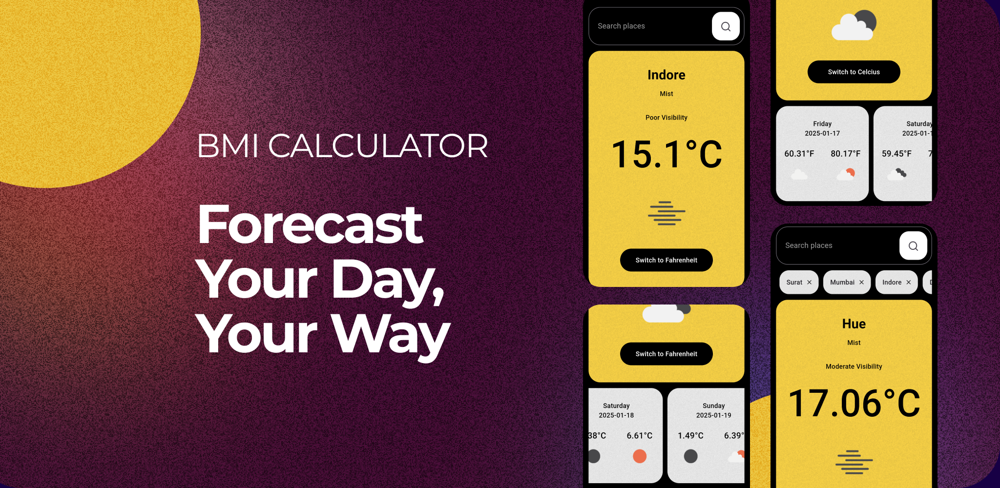
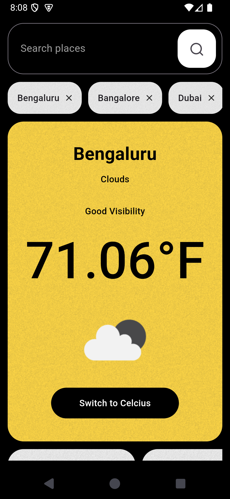
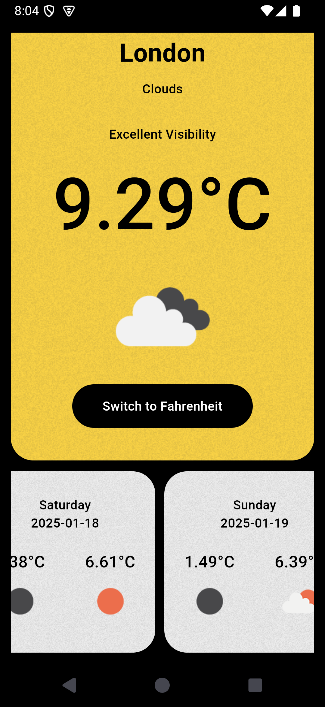

# Weather App

A Flutter application to fetch and display current weather, a 3-4 day forecast, and manage search history using the MVVM architecture.

---

## Features

- **Current Weather:** Displays the current temperature, humidity, and weather conditions.
- **Weather Forecast:** Provides the minimum and maximum temperatures for the next 3-4 days.
- **Search History:** Saves and displays the last searched city for convenience.

---

## Architecture

The app uses the **MVVM (Model-View-ViewModel)** pattern:

- **Model:** Handles API calls and business logic.
- **ViewModel:** Manages state and acts as a bridge between the Model and the View.
- **View:** Displays data to the user and reacts to state changes.

---

## Libraries Used

- `Provider`: For state management.
- `SharedPreferences`: To store the last searched city.
- `Dio`: For making network calls.

---

## API Endpoints

1. **Current Weather:**
   `https://api.openweathermap.org/data/2.5/weather?q=cityname&units=metric&appid=YOUR_API_KEY`

2. **Weather Forecast:**
   `https://api.openweathermap.org/data/2.5/forecast?q=cityname&units=metric&appid=YOUR_API_KEY`

---

## Modules

- **HomePage:** Central hub integrating all submodules.
- **Weather Module:** Fetches and displays today's weather.
- **Forecast Module:** Displays the next 3-4 days of weather data.
- **History Module:** Manages the last searched city using `SharedPreferences`.

---

## Installation

1. Clone the repository.
2. Run `flutter pub get` to install dependencies.
3. Replace `YOUR_API_KEY` with your OpenWeatherMap API key.
4. Run the app using `flutter run --dart-define=API_KEY=YOUR_API_KEY`.

---

## Screenshots & Video

  
  

[preview.webm](https://github.com/user-attachments/assets/91ac7486-6081-4938-98fc-40a6e749adc7)

---

## License

This project is licensed under the MIT License.
